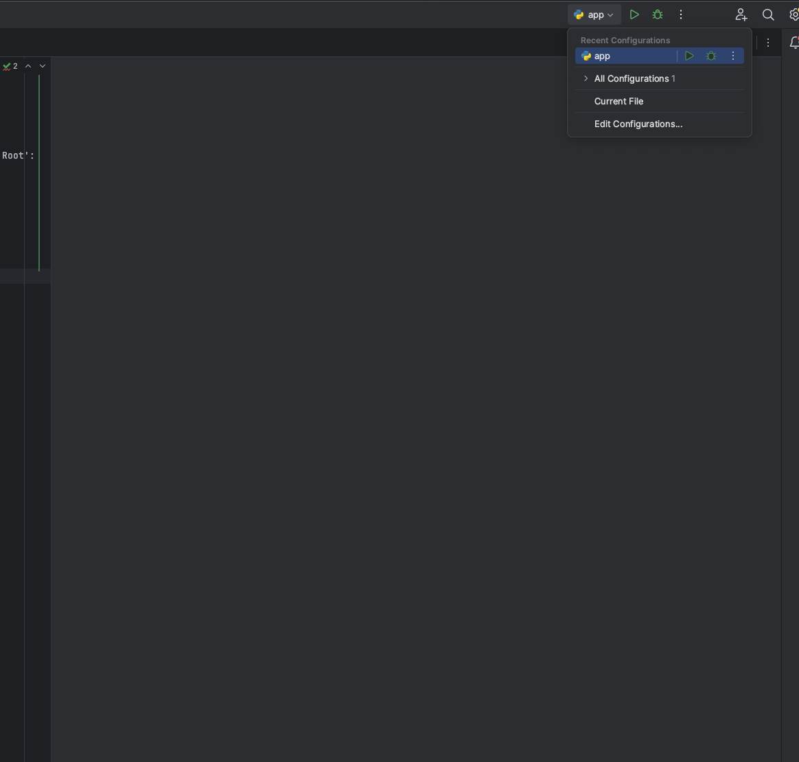
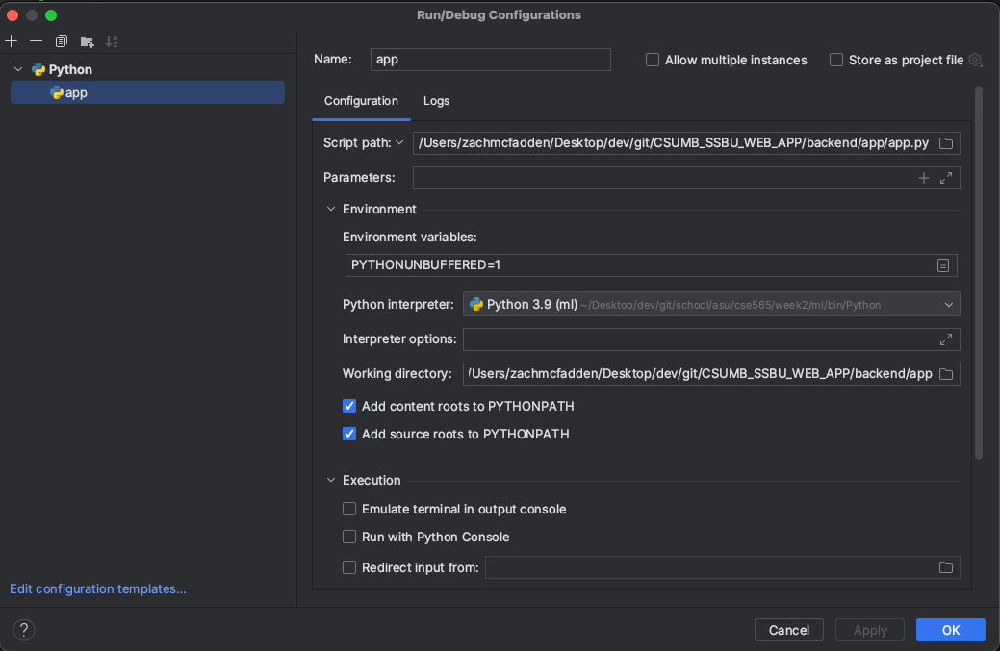

# Backend 

## Setup

You can run `./scripts/sh/setup.sh` in order to setup python with the relevant packages for the python backend. 

For this project, I would suggest [pycharm](https://www.jetbrains.com/pycharm/?source=google&medium=cpc&campaign=amer_en_us_pst_mst_pycharm_branded&term=pycharm&content=785237935109&gad_source=1&gad_campaignid=14124131751&gbraid=0AAAAADloJzjqT7BIj71FqE_J49tpTs_Us&gclid=Cj0KCQiAkPzLBhD4ARIsAGfah8iRGkgsjyc2vKUucsncDh_OVaKCL_HGw_o99FyeL3kocOuubr6UMnkaAkiNEALw_wcB)

**Loading in pycharm**: If you load the ENTIRE github project, make sure to mark the `app` directory as a 'Sources Root':

The `app` folder should appear blue once this is complete: 

Add a new python configuration for app, it should be in the top right hand corner of pycharm.

Your configuration should look something (BUT NOT EXACTLY) like this: 

